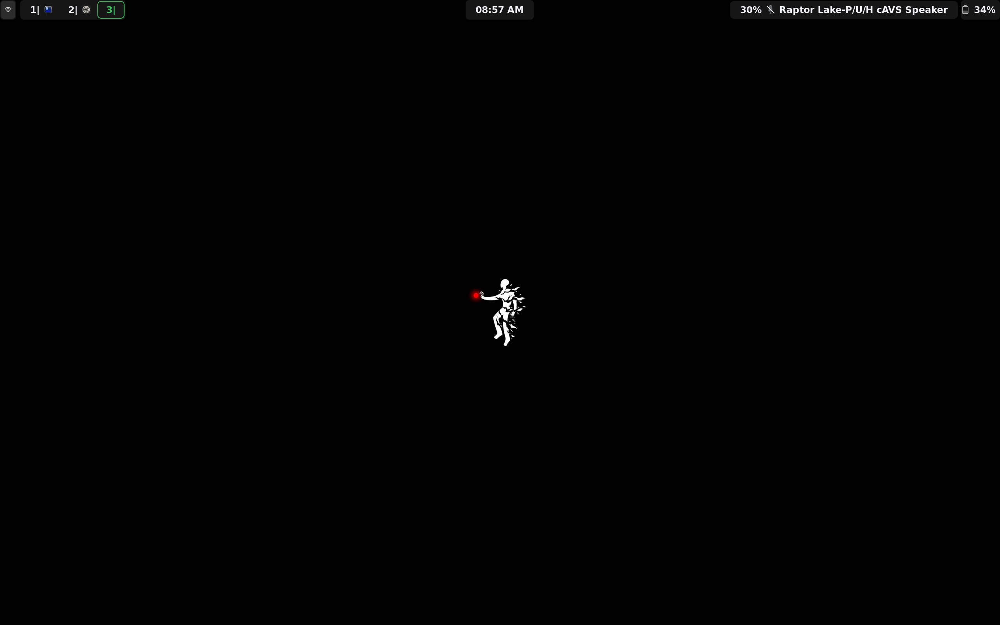
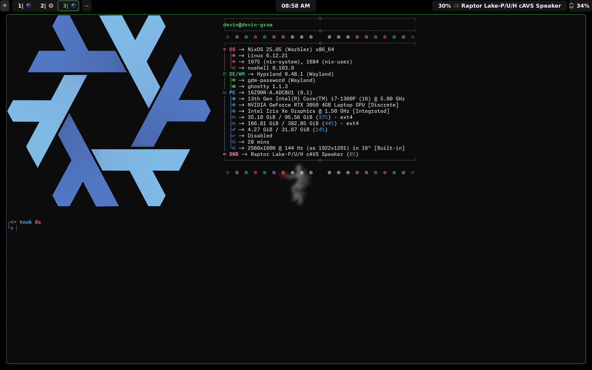

= My NixOS Configuration

== Introduction

This repo contains the NixOS system configurations for my desktop and laptop NixOS computers. The grand majority of configuration is shared between the two systems, located in `global`. The repo also contains my Hyprland rice and other app configuration.

== The Rice

The system is themed mostly via https://github.com/danth/stylix[Stylix], using https://github.com/nyoom-engineering/base16-oxocarbon[Oxocarbon] for colors, https://www.michieldb.nl/other/cursors/[Posy's cursor], https://monaspace.githubnext.com/[GitHub Monaspace] Neon for monospace text, and https://www.deviantart.com/sunnyclockwork/art/SCP-3001-678884225[this piece by SunnyClockwork] for the wallpaper. It uses Waybar, `swaybg`, `swaynotificationclient`, and `swaylock` (on the laptop only).

== Screenshots

image::media/swaylock-laptop.png[]
